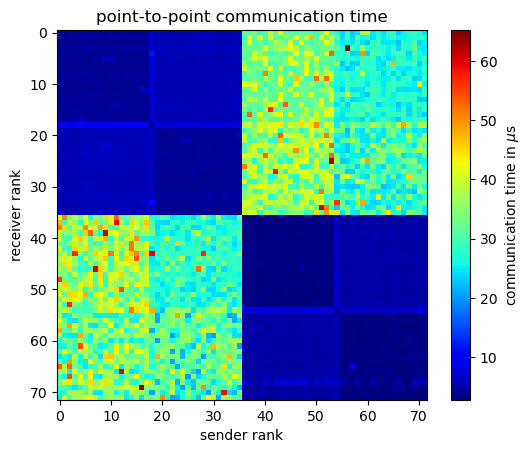
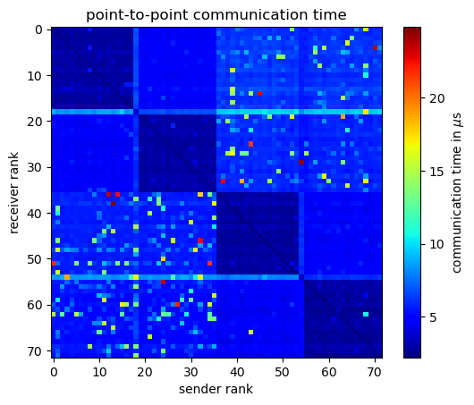

# Basic communication patterns in MPI

- basic usage of queueing system slurm (https://slurm.schedmd.com/)
---
- time measurment in parallel (`task0_parallel_timing.py` and `task0_comm_latency.py`)
---
- point-to-point communication (`task1_pingpong.py`)
  1. python wrappers variants: (https://mpi4py.readthedocs.io/)
     - python wrapped (can communicate any python object): `send`/`recv` 
     - direct call to MPI subroutines (can communicate plain data - numpy arrays): `Send`/`Recv`
  2. MPI specification variants (https://www.mcs.anl.gov/research/projects/mpi/sendmode.html)
     - blocking communication (wait until data can be safely used)
       - synchronous blocking communication: `Ssend` - returns after all data received
       - buffered blocking communication: `Bsend` - return after all data are buffered
       - `Send` can choose `Ssend` or `Bsend` depending on data size
     - nonblocking communication (imediate return)
       - synchronous mode nonblocking communication: `Issend`/`Irecv`
       - buffered mode nonblocking communication: `Ibsend`/`Irecv`
       - again `Isend`/`Irecv` will use mode depending on data size
---
- collective communication (`task2_bcast_reduce.py` and `task3_scater_gather.py`) (images from https://github.com/mpitutorial/mpitutorial)


- any-to-any communication in nonuniform system (`task4_pingpong_array.py`)

Timing of point-to-point communication time (`Ssend`/`Recv`) on 2 nodes, each node has 2 cpus with 18 cores per cpu, without infiniband connection.
```
UCX_TLS=tcp,sm srun -p express3 -u --tasks-per-node=36 -n 72 -N 2 --cpu-bind=rank python task4_pingpong_array.py
```


Timing of point-to-point communication time (`Ssend`/`Recv`) on 2 nodes, each node has 2 cpus with 18 cores per cpu, with infiniband connection.
```
srun -p express3 -u -l --tasks-per-node=36 -n 72 -N 2 --cpu-bind=rank python task4_pingpong_array.py
```

